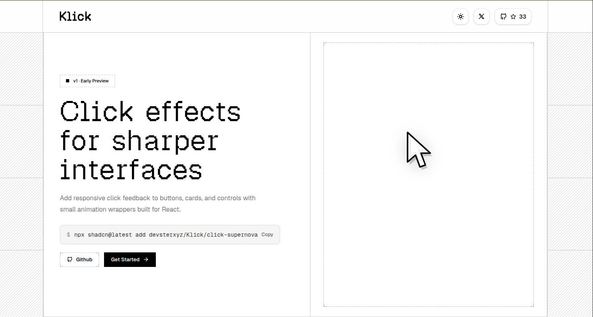

# Klick

A cursor click animation library for React and Next.js, sprinkle delightful click effects on any element with a single CLI command.



<!-- Note: drop your home page screenshot into a public/ or .github/ folder in the repo and point the path above at it -->


> Live demo: [klick-here.vercel.app](https://klick-here.vercel.app/)

## Table of Contents

- [What is Klick?](#what-is-klick)
- [Component Examples](#component-examples)
- [Available Components](#available-components)
- [How it Works](#how-it-works)
- [Issues You Might Face](#issues-you-might-face)
- [Development](#development)
- [License](#license)

## What is Klick?

Klick is a cursor click animation library for React and Next.js components or pages. Wrap any element, a button, a card, a whole page, and every click triggers a canvas-based animation like rain droplets, hearts, radiating lines, smoke puffs, and more. Components install with a single CLI command (powered by shadcn/ui), so the code lands directly in your project, fully typed and ready to customize.

## Component Examples

**ClickDroplet**  a rippling splash effect on click.

```tsx
<ClickDroplet
  splashCount={6}
  ringSpeed={2}
  duration={2000}
  dotColor="#ffffff"
>
  <Card />
</ClickDroplet>
```

**ClickHeart**  little hearts that pop out on click.

```tsx
<ClickHeart
  count={5}
  sizeMin={18}
  sizeMax={28}
>
  <Card />
</ClickHeart>
```

**ClickRain**  falling streaks that ripple where they land.

```tsx
<ClickRain
  strokeColor="#ffffff"
  dropCount={15}
  spreadX={120}
  streakHeight={15}
>
  <Card />
</ClickRain>
```

## Available Components

48 installable click animations. Wrap any element in one of these and every click triggers the effect.

| Component | | |
|---|---|---|
| `click-binary` | `click-agitate` | `click-alignment` |
| `click-black-hole` | `click-blast` | `click-bounding-box` |
| `click-bullet-time` | `click-diffusion` | `click-double-sonar` |
| `click-droplet` | `click-embers` | `click-fire` |
| `click-fire-trail` | `click-firework` | `click-fission` |
| `click-flame` | `click-float` | `click-flow-field` |
| `click-focus` | `click-fusion` | `click-generative` |
| `click-geo` | `click-ghost` | `click-heart` |
| `click-holo-sphere` | `click-load` | `click-matrix-rain` |
| `click-ping` | `click-quantum` | `click-radiate` |
| `click-rain` | `click-resonance` | `click-ripple` |
| `click-ripple-matrix` | `click-shatter` | `click-skull` |
| `click-smoke` | `click-sonar` | `click-solid-ripple` |
| `click-spark` | `click-spark2` | `click-sparkle` |
| `click-splash` | `click-supernova` | `click-synapse` |
| `click-tesseract` | `click-warp` | `click-prompt` |

Install any component individually:

```bash
npx shadcn@latest add devsterxyz/Klick/click-alignment
// etc
npx shadcn@latest add devsterxyz/Klick/click-binary
```

## How it Works

Every click component follows the same core pattern:

1. **A fixed full-screen canvas is portaled to `document.body`.** Using `createPortal`, a `<canvas>` is rendered outside the normal DOM tree and pinned to the viewport with `position: fixed`, `pointerEvents: 'none'`, and a high `z-index`. This lets the animation draw on top of your entire page without blocking clicks or affecting layout. The canvas resizes itself on every window resize to always match the viewport.

2. **A click handler spawns particles at the cursor position.** The wrapping `<div style={{ display: 'contents' }}>` listens for `onClick` and reads `e.clientX` / `e.clientY` directly since the canvas is `fixed`, no offset math is needed. Depending on the component, this creates a batch of "particles" (droplets, hearts, rays, smoke puffs) with randomized starting properties like position spread, velocity, and size, each tagged with a `startTime`.

3. **A `requestAnimationFrame` loop draws and ages every particle.** On each frame, the canvas is cleared and every active particle is redrawn based on how much time has elapsed since its `startTime`. Particles update their position/size each frame (falling, rising, expanding, etc.) and fade out using `globalAlpha` as they approach their `duration`. Once a particle's elapsed time exceeds `duration`, it's filtered out of the array keeping the particle list lean and the animation loop running only as long as needed.

This shared architecture means every Klick component is self contained, has no external animation dependencies, and cleans up its own `requestAnimationFrame` and resize listeners on unmount.

## Issues You Might Face

**1. Component installs but the animation doesn't show up.**
Check the `zIndex` of the portaled canvas against other elements on your page. If you have modals, overlays, or sticky headers with a higher `z-index`, the animation canvas can end up rendering behind them. Bump the component's canvas `z-index` (or lower the conflicting element's) so the animation sits on top.

**2. The CLI install command fails.**
Klick's CLI is built on top of shadcn/ui, so it needs shadcn set up in your project first. Install and initialize shadcn/ui by following the official guide: [ui.shadcn.com/docs/installation](https://ui.shadcn.com/docs/installation), then re-run the Klick install command.

## Development

To run Klick locally:

```bash
git clone https://github.com/devsterxyz/Klick.git
cd Klick
npm install
npm run dev
```

This spins up the local dev server with the full component playground so you can preview and tweak animations before installing them into another project. Contributions, issues, and pull requests are welcome on [GitHub](https://github.com/devsterxyz/Klick).

## License

This project is licensed under the MIT License.